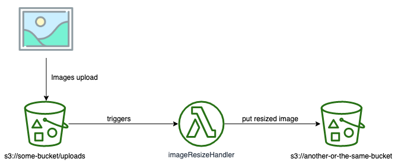

# [WIP] serverless-image-resize



This is a sample project illustrating how you can handle with S3 trigger events using AWS lambda functions.

In this sample we will resize all images uploaded to a specific S3 bucket (as you can see in the image above).

## Getting Started

These instructions will get you a copy of the project up and running on aws cloud. 

First of all you need to clone this repository in your machine:

```bash
git clone git@github.com:muriloamendola/serverless-image-resize.git
```

To install project dependencies just run:

```bash
npm i
```

### Prerequisites

This project have been developed using `Serverless Architecture` and to help us to deploy and operating the resources in to the Cloud we decided to use [Serverless Framework](https://serverless.com). For use of Serverless Framework we need to install `serverless cli` running the following command:

```bash
npm install -g serverless
```

### Deploy to AWS

After [configure your aws credentials](https://docs.aws.amazon.com/pt_br/cli/latest/userguide/cli-chap-configure.html) just run the following command:

```bash
sls deploy --stage dev
```

## Authors

* **[Murilo Amêndola](https://www.linkedin.com/in/muriloamendola/)** - <muriloamendola@gmail.com>

See also the list of [contributors](https://github.com/muriloamendola/graphql-serverless/contributors) who participated in this project.
